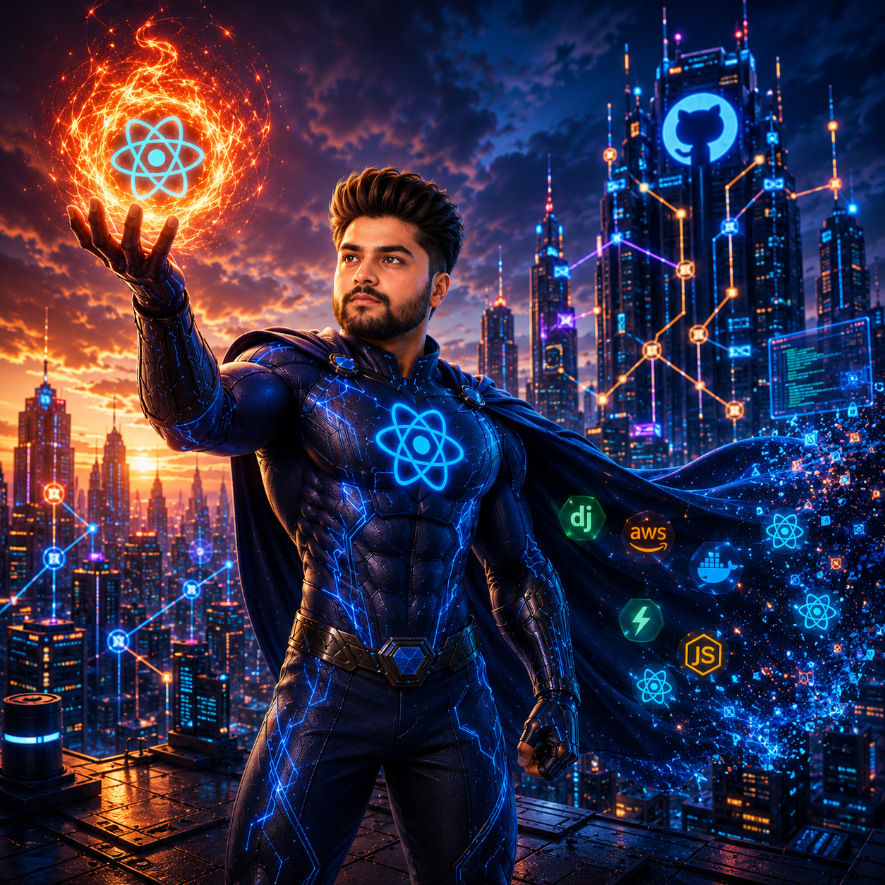

<!-- ══════════════════════════════ HERO ══════════════════════════════ -->

# Anutosh Mishra

### Full-Stack & Mobile Developer · Building AI-Powered Products

I ship real apps end-to-end — from React Native front-ends to serverless backends and RAG-based AI features. Currently final-year B.Tech, sharpening MERN + System Design, and looking for my first full-time SWE role.

 

<!-- ══════════════════════════════ ABOUT ══════════════════════════════ -->
## 🚀 About Me

- 🔭 **Currently building:** two production apps — **Vibe** (proximity-based networking, live on the App Store) and **Bhagwat Vaani** (a RAG-powered scripture Q&A app).
- 🌱 **Learning right now:** MERN stack, Data Structures & Algorithms, and System Design fundamentals.
- 🧠 **Ask me about:** React Native, Firebase, building LLM/RAG features, and taking a mobile app from idea → App Store.
- 📫 **Reach me:** [ashu2010.55@gmail.com](mailto:ashu2010.55@gmail.com)
- 📍 **Based in:** Greater Noida, India — open to remote & relocation.

<!-- ══════════════════════════════ PROJECTS ══════════════════════════════ -->
## 🛠️ Featured Projects

| Project | What it does | Stack |
| :------ | :----------- | :---- |
| **Vibe** | Proximity-networking app that connects people nearby in real time. Shipped to the App Store. | React Native · Expo · Firebase · Cloud Functions |
| **Bhagwat Vaani** | RAG-based Q&A app answering questions from scripture using vector search + LLMs. | React Native · Firebase · Vector Search · LLMs |

<!-- ══════════════════════════════ SKILLS ══════════════════════════════ -->
## 💻 Tech Stack

**Languages**

  

**Frontend & Mobile**

  
  
  

**Backend**

  
  
  

**Databases & Cloud**

  

**AI / ML**

  
  
  
  

**Tools**

  

<!-- ══════════════════════════════ STATS ══════════════════════════════ -->
## 📊 GitHub Stats

 

 

<!-- ══════════════════════════════ FOOTER ══════════════════════════════ -->

⭐️ From [Honey5755](https://github.com/Honey5755) — let's build something.

